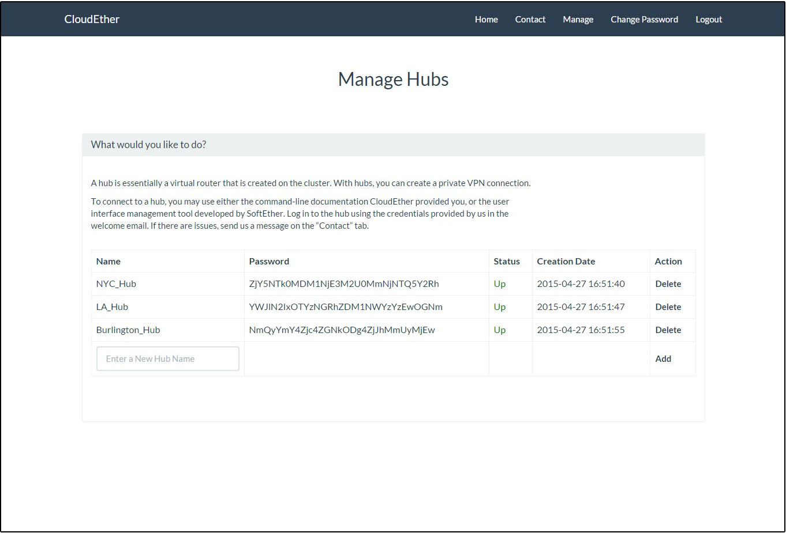

# CloudEther

### About
CloudEther is a proof of concept project that shows that a Cloud VPN provider can be created with a SoftEther VPN server cluster. CloudEther is a bootstrap based web interface that allows administrators to create client accounts. These client accounts can then create hubs through the interface and can then manage the hub using the SoftEther Management Tool.

### Installation
Documentation on installing the SoftEther VPN cluser and CloudEther can be found in the docs folder.

### To Do (beyond this project)
- Add auditing and error logging to the web application
- Create a payment system
- Make all common tasks of managing SoftEther done through the web interface rather than giving them full access to the hub

### Credits
- Ahmed Nouri
- Liam Callaghan
- Charles Iszard
- Matthew Prahl
- Henry Quinn

### Screenshot

